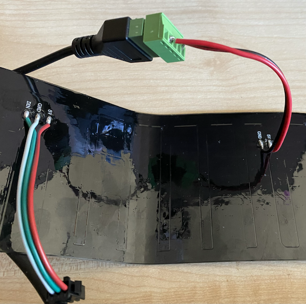
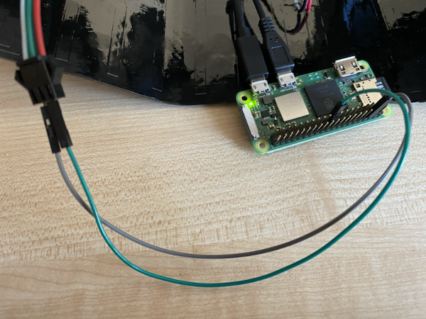

# NeoPixel Ticker Tape

A .NET library to show and scroll text on a 8x32 NeoPixel (WS2812b LED) panel controlled by a Raspberry Pi.

## Hardware

To use this, you will need the following hardware:

* A Raspberry Pi (any Pi that supports .NET will work, including the Pi Zero W 2)
* A 8x32 NeoPixel panel, such as [this panel on Amazon](https://amzn.to/3sVjF7M) - this is an affiliate link
* A 5V power supply for the panel (it draws too much power to be powered from the Pi)
* Jumper wires

## Pi setup

To set up your Pi and panel:

* Connect the 5V supply to the 5V and GND connections of the NeoPixel panel. These power connections are in the middle of the panel, and are not the input or output connections.

    

* Connect the GND connection on the input side of the NeoPixel panel to a GPIO GND pin, for example the 3rd pin from the SD card end on the outside of the Pi.

* Connect the DIN connection on the input side of the NeoPixel panel to the GPIO10 pin (SPI COPI). This is the 10th pin from the SD card end on the inside of the Pi.

    

* Ensure SPI is enabled, either by:

  * Turning SPI on in `raspi-config`
  * Turning SPI on in `/boot/config.txt`:

    ```ini
    dtparam=spi=on
    ```

* Fix the core clock to ensure SPI doesn't change speed by adding this to `/boot/config.txt`:

    ```ini
    core_freq=250
    core_freq_min=250
    ```

## Using the code


